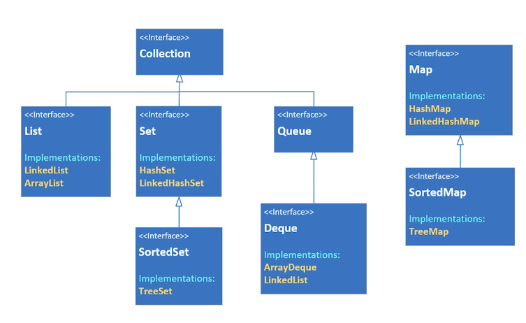

# Java Udemy course notes

## First steps

- Statement: It's a complete command to be executed
  - It can include one or more expressions
- Declaration statement: It defines a variable indicating the type, name, and optionally the value
- Expression: It's a coding construct that evaluates to a single value
  - It's the code segment that in on the right side of the equals sign in an assignment or declaration statement
- Keyword: It's a reserved word that has a predefined meaning in Java
- Variable: It stores some info in the computer memory (in the RAM)

### Primitive types (8)

All of them have their wrapper class, which olds further info from the type, like min and max value

- Whole number: byte (Byte.MIN_VALUE, Byte.MAX_VALUE), short, int, long (Long.MIN_VALUE, Long.MAX_VALUE)
  - For long values, use the letter L at the end of it, otherwise it will be transformed into an int by default
  - All of those types have overflow/underflow problem
- Real number: float, double
- Single character: char
- Boolean value: boolean

### Casting

(newType) (expression);

### Floating point numbers (float and double)

- For whole numbers, int is the default
- For floating, the double in the default
- Don't forget the F and the end for float numbers and D for double numbers
- Double is faster
- For precise calculations, use BigDecimal

### char (two bytes of memory)

- Use single quotes for char
- Use double quotes for strings
- char values don't get concatenated. Whats is added is their ASCII number
- 3 different ways to assign a value
  - char myChar = 'D';
  - char myChar = '\u0044';
  - char myChar = 68;

### String

A class that contains a sequence of chars

StringBuilder class is better suited to string concatenation

Better suited when you need to create many string objects

StringBuilder is an mutable object

Scape sequences

| Scape sequence | Description                     |
| -------------- | ------------------------------- |
| \t             | Insert a tab character          |
| \n             | Insert a new line character     |
| \\"            | Insert a double quote character |
| \\             | Insert a backslash character    |

### Text block

- It is a multi-line string literal
- It has 3 \\"
- You format the output as you write

```java
String textBlock = """
    First line
    Second line
    Third line""";
```

### String format specifiers

`%[argument_index$][flags][width][.precision]conversion`

| Conversion | Argument category |
| ---------- | ----------------- |
| s          | string            |
| d          | integer           |
| c          | char              |
| f          | floating point    |
| n          | new line          |
| %          | percent           |

- For outputting, use `System.out.printf()`
- For strings, use `String.format()` or `.formatted()` on the string literal
- Use `1

```java
String something = "Hi. My name is %s. I'm %d years old".formatted("Isaac", 27);
```

### String methods (over 60)

- Inspection methods
  - length
  - charAt
  - indexOf
  - lastIndexOf
  - isEmpty => `returns true if length is zero`
    - `" ".isEmpty() // returns false`
  - isBlank => `returns true if length is zero or the string only contains whitespace characters` ⬅️
    - You normally want to use `isBlack`
    - `" ".isBlank() // returns true`
- Comparison methods
  - contentEquals
  - equals ⬅️
  - equalsIgnoreCase ⬅️
  - contains ⬅️
  - startsWith
  - endsWith
  - regionMatches
- Manipulation methods
  - indent => adds or removes spaces
  - strip ⬅️ use it instead of trim
  - trim
  - toLowerCase
  - toUpperCase
  - concat
  - join
  - repeat
  - replace
  - subString
  - subSequence
  - split(separator)
    - Just like in javascript
  - join(separator, array)
    - Just like in javascript

### StringBuilder

- Act on the original string
- You don't need to reassign it
- It's like the methods from JS that change the original array

#### Instantiating StringBuilder

4 ways: string literal, nothing, int, another StringBuilder

```java
StringBuilder helloBuilder = new StringBuilder("Hello");
StringBuilder emptyBuilder = new StringBuilder();
StringBuilder emptyBuilder5 = new StringBuilder(5); // capacity of maximum length 5; default is 16
StringBuilder stringBuilder = new StringBuilder(helloBuilder);
```

It has a method to reverse a string

### Method

- A method that doesn't return anything is called a procedure
- A method signature is the number and the type of the parameters
  - A signature is unique, not just by the method name, but in combination with the number of parameters, their types, and the order in which they are declared
  - A method signature doesn't include the return type nor the parameter name
- Use method overload for handling default parameters

### Switch

- Valid switch value [switch(value)]
  - byte, short, int, char
  - Byte, Short, Integer, Char
  - String
  - enum
- long, float, double, or boolean and their wrappers can't be used

### var

- `var` is a special contextual keyword in Java that takes advantage of local variable type inference
- You don't need to assign a type to the variable

### Checking runtime type with `instanceof`

```java
Object unknown = Movie.getMovie("Title", "Type");
if (unknown instanceof Advanture) {
  Advanture unknown = (Advanture) unknown;
  advanture.showMovie();
}
```

### `instanceof` with pattern matching

Creates a local variable correctly typed without casting

```java
Object unknown = Movie.getMovie("Title", "Type");
if (unknown instanceof Advanture advanture) {
  advanture.showMovie();
}
```

#### Enhanced switch statements

- No brake needed
- No colon after case value
- More readable
- You can return the switch
  - For the return at a default in a code block, use `yield` as it it were a return

```java
switch (switchValue) {
  case 1 -> System.out.println("case 1");
  case 2 -> System.out.println("case 2");
  case 3, 4, 5 -> {
    System.out.println("case 3 4 5");
    System.out.println("New switch, but still similar to JavaScript");
  }
  default -> System.out.println("Default");

}
```

## OOP

A class is a template for creating objects

You create an object by instantiating a class

Object and instance are interchangeable

`this` refers to the instance that was created when the object was instantiated

### Keywords

- `static`
  - Value of the field is stored in special memory location and only in one place
  - Accessed by ClassName.fieldName
  - It doesn't belong to the object, but to the class
  - A static method can't reference any of the instance members (fields or methods)
  - Whenever you see a method that don't use the instance variables, it should probably be declared as a static method
  - Common uses:
    - Storing counters
    - Generating unique ids
    - Storing a constant value
    - Creating and controlling access to a share resource
- `null`
  - It means the variable or attribute has a type, but no reference to an object
  - For primitive data types, they receive their default value
    - boolean => false
    - byte, short, int, long => 0
    - float, double => 0.0

### Constructor

A function that is called when the object is instantiated

If a class has no constructor, the default constructor is implicitly declared

The default constructor has no args (no-args constructor)

If a class has any other constructor, then de default one is not implicitly declared

A `private` constructor makes the class not extendable and makes it impossible to instantiate it

#### Constructor overloading

It's the same than function overloading, but for constructors

#### Constructor chaining

When one constructor calls another overloaded constructor

You can call a constructor only from another constructor

You must use the special statement `this()` to execute another constructor, passing arguments if required

`this()` must be the first executable statement, if it's used from another constructor

### Packages

A package is a namespace that organizes a set of related types

Classes can be organized into logical groupings called packages

If you don't declare a package, the class implicitly belongs to the default package

It's a common practice to use the reverse domain name to name a package

```
company domain name: abccompany.com
package prefix: com.abccompacny
```

The package statement needs to be the first in the code, even before the import statements

### Access modifiers

Access modifiers in Java are used to set the visibility and accessibility of classes, methods, and variables

- `public`
  - The public keyword allows a class, method, or variable to be accessible from any other class in your application
- `private`
  - The private keyword restricts the accessibility of a class, method, or variable to its own class
- `protected`
  - The protected keyword allows a class, method, or variable to be accessible within its own package and by subclasses in other packages
- In Java, if you do not specify an access modifier, it defaults to package-private, which allows a class, method, or variable to be accessible within its own package

### Top-level class

A class defined in the source code file, and not enclose in the code block of another class, type, or modified

It has only 2 access modifiers" `public` or none [default] (omitted modifier, meaning the class is accessible only to classes in the same package)

### POJO (plain old Java object)

A class that generally has only instance fields

Used to store and pass data between functional classes

It also might be called a bean, or JavaBean

Another acronym is DTO, data transfer object

Sometimes also called an Entity, because it reflect the database entities

Many frameworks use POJO's to read data from or write data to databases, files, or streams

### Record (JDK >= 16)

It removes the boiler plate that POJO has, but to be more restrictive

Java calls them "plain data carriers"

Record is a special class that contains data that's not supposed to be changed

It creates the fields and the getters

Fields (component field) are private and final

### Encapsulation

- Hiding of fields and some methods from public access
- Easier to debug, because you know where and when the field was changed
- Bundling of fields and methods on a single object
- Normally, the fields are private. So you create getters and setters to handle those fields

### Inheritance

- Code reuse
- Organize classes into a parent-child hierarchy
  - Child inherits fields and methods from its parent
- A child can have only one direct parent, but it inherit from the parent class's parent, an so on
  - Only one class ofter `extends`
- `super()` calls the constructor of the parent class
  - like `this()`, `super()` has to be the first statement of the constructor
  - `this()` and `super()` can never be called from the same constructor
  - if you don't male a call to `super()`, than Java makes it for you, calling the super's default constructor

#### `java.lang.Object`

Every class and array inherits from `Object`

`hashCode()` is unique among class instances

### Polymorphism

- It means many forms
- When a child class overrides a parent class to make a new implementation of a method

### Composition

A class that is made out of other classes

Prefer composition over inheritance

Inheritance breaks encapsulation, because subclasses may need direct access to a parent's state or behavior

## Arrays

### Declaration

```java
// type[] arrayName;
String[] nameList;
```

### Instantiation

Array isn't resizable; Once instantiated, no more elements can be added;

```java
int[] integers = new int[10];
```

### Array initializer

It can only be used in a declaration statement

```java
int[] integers = {0 ,1 ,2 ,3 ,4 ,5};
```

### Array methods

See `java.util.Arrays`

- void sort `Arrays.sort(array)`
- void fill `Arrays.fill(array, value)`
- array copyOf `Arrays.copyOf(array, length)`
- int binarySearch `Arrays.binarySearch(array, value)`
  - Returns the position the match was found; otherwise returns -1
  - Array has to be sorted!!!
  - If there are duplicates, there is no guarantee which one it will match on
  - Elements must be comparable
- boolean equals `Arrays.equals(array1, array2)`
- ArrayList<T> `Arrays.asList(T)`
  - Returns a list that can't be resizable
  - A change in the list also changes the array
- T setAll `Arrays.setAll(array, Consumer)`

### varargs (just like rest parameters in javascript)

```java
public printTest(String... strings) {
  // the list of args passed to printText becomes an array called strings
  for(String s: strings) {
    System.out.println(s);
  }
}
```

## Random

Access methods as `random.method`;

```java
Random random = new Random();
random.methods;
```

## List (improvement of arrays)

A List is an interface

`Ordered by insertion order`

### Methods to know

- `List.of(array)`, `List.of(comma-separated-values)`
  - Return a resizable list from the input
- `List.copyOf(List)`
  - Return a copy of the input list

### ArrayList

`Use the type List<T> for the reference value`

It's a resizable array that implements the list interface

```java
List<GroceryItem> groceryItemArrayList = new ArrayList<>();
```

```java
List<String> namesList = new ArrayList<>(List.of(namesArray));
```

#### Nice methods

- `contains`

## Boxing and unboxing

From primitive (int) to a wrapper (Integer): boxing

From wrapper (Integer) to primitive (int): unboxing

Each primitive (8 in total) has a wrapper class

If you want a boxed primitive, always prefer to instantiate it by using `Wrapper.valueOf(primitive)`

If you want to primitive value that the wrapper class contains, use:
`box.intValue()`, `box.booleanValue()`, `box.doubleValue()`, ...

```java
Integer boxedInt = Integer.valueOf(15);
```

## Autoboxing and automatic unboxing

`Preferred method!`

Java does the conversion behind the scenes

```java
Integer boxedInt = 15;
int unboxedInt = boxedInt;
```

## Enum type

An enum is a data type that contains predefined constants

In its simplest form, an enum is described like a class, but the keyword `enum` replaces the keyword class

The enum name should be in Upper CamelCase

Each identifier is separated by commas

The identifiers should be in uppercase label

Enum constructor is private, so you cannot instantiate it

You can also define noArgsConstructor to define default values

You can also defined initializers for each enum field

```java
public enum DaysOfTheWeek {
  MONDAY,
  TUESDAY,
  WEDNESDAY,
  THURSDAY
  FRIDAY
  SATURDAY,
  SUNDAY
}
```

### Built-in methods

- `identifier` gets the value
- `identifier.name()` gets the value
- `identifier.ordinal()` gets the position
- `Enum.values()` gets the values as an array
- `Enum.valueOf()` useful for casting

### Custom methods

- End the last identifier with a semicolon
- Return the information for each field using `switch(this)`

## Abstraction

### abstract class

It's said to be incomplete

You can create an instance of an abstract class

It can have a constructor which will then be called by subclasses

It's used when you want to define a certain structure to be implemented by subclasses

`An abstract class can also have concrete methods`

```java
abstract class Animal {}
```

### abstract method

it can only be declared in an abstract method or interface

it has a method signature and a return type, but doesn't have a body

it's an unimplemented method

`then a concrete method implements the abstract method by overriding it`

```java
abstract class Animal {
  public abstract void move();
}
```

## Interface

```java
public interface FlightEnabled {}
```

```java
public class Bird implements FlightEnabled {}
```

An interface is similar to an abstract class, but it's not a class

It's a especial type that's more like a contract between the class and the client code

It let us take objects that may have almost nothing is common and write reusable code so we can process them in a like manner

By using an interface, the class must implement all the abstract methods

Use the interface keyword

The class `implements` the interface

An interface can't implement another interface, but it can extend from it

A class can implement many interfaces, while it can extend only one class

Records and enums can implement an interface

### The default behavior for an interface

- `abstract` for the interface itself
- unimplemented methods to be `public and abstract`
- fields to be `public static final`
  - It's a constant

After JDK8, you can change it by adding modifiers to fields and methods of the interface

It's helpful because a change to the interface forces a change to all classes implementing it

- `default`
  - defines a concrete method
  - it must have a method body
  - it can be overridden by who will implement the interface
  - it doesn't brake classes currently implementing the interface

Whenever you call the default method from the overridden method, you need to qualify super with the interface type

### Other options for access modifiers in interfaces

- static
- private

## Abstract class vs Interface

An abstract class provides a common definition, as a base class, that multiple, derived classes can share

The interface decouples the "what", from the "how", and is used to make different types, behave in similar ways

### Abstract class

- you can declare fields that aren't static and final, instance fields in other words
- you can use any of the four access modifiers for its concrete methods
- You can also use all but the private access modifier for its abstract methods
- An abstract class can extend only one parent class, but it can implement multiple interfaces

## Generics

### Generic class

```java
class YouTellMe<T> {
  private T field;
}
```

### Conventions

- E for Element (used extensively by the Java Collections Framework)
- K for Key (used for mapped types)
- N for Number
- T for Type
- V for Value
- S, U, V etc, for 2nd, 3rd, 4th types

### Keyword `extends`

Fine-grained control over the type parameter, just like in TS

It defines the `upper bound` for the types that are allowed

```java
public class Team<T extends TeamMember>
```

When the upper bound is not defined, the default is java.lang.Object, so `try to use it when possible`

### Passing many upper bounds

```java
public class Team<T extends TeamMember & QueryItem>
```

- You can use extend for only one class
  - Class must be the first one listed
- You can pass as many interfaces as possible after `&` character

### Generic methods in non-generic class

Use an slot for `T` before the function return type

```java
public static <T extends Student> void printList(List<T> students) {
  students.forEach(System.out::println);
  System.out.println();
}
```

### Generic wildcards (type parameter wildcard)

A wildcard can be used only in a `type parameter`, not in the type parameter declaration (when declaring a variable for example)

It cannot be used while instantiating a class

It's represented by the `?` character

It means the type is `unknown`

It can be unbounded, upper bounded or lowe bounded

- unbounded: `List<?>`
- upper bounded `List<? extends Student`
  - A list containing any type that is a Student or a class that extends from Student (sub type of Student)
- lowe bounded `List<? super LPAStudent>`
  - A list containing any type that is an LPAStudent or classes that LPAStudent inherits from, for example Student and Object (supper type of LPAStudent)

## Type Erasure

At compile time, everywhere a type parameter is used in a class, `it gets replaced with either the type Object, if no upper bound was specified, or the upper bound type itself`

This transformation process is called type erasure, because the T parameter (or S, U, V) is erased or replaced with the true type

When encountering type erasure problems, define an upper bound or handle different possibilities inside the function

## Manually passing type parameters to a function call

```java
QueryList.<Student>getMatches(students, "COURSE", "JAVA");
```

## Comparable interface

The classes implementing it should have a method `int compareTo(T o)`

It returns zero if `val` is equal

It returns a positive value if `val` is greater

It returns a negative value if `val` is smaller

Built-in wrappers implement it

String implements it by looking at the first characters. If they are the same, the second characters are compared. For comparison, they use the characters ASCI code int value

### Making classes comparable

```java
 class myClass implements Comparable<myClass> {
  // 1 arg to compare
 }
```

For a function that expects a comparator, if you pass null, it will use the `compareTo` method that the class itself implements

## Comparator

You create a class that implements `Comparator<myClass>`

Then you use this class where it's needed

For example, with `Arrays.sort(T[] array, Comparator<T> new myComparator())`

It doesn't require the `T` to implement `Comparator`

```java
class myComparator implements Comparator<myClass> {
  // implement the methods you need
}
.
.
.
Arrays.sort(array, new myComparator());
Arrays.sort(array, new myComparator().reversed());
```

## Nested classes

| Type                    | Desc                                                                                                                                                                                                                                                                                                          |
| ----------------------- | ------------------------------------------------------------------------------------------------------------------------------------------------------------------------------------------------------------------------------------------------------------------------------------------------------------- |
| static nested class     | - declared in class body <br/> - just like a static field <br/> - access to this class is through the Class name identifier <br/> `var comparator = new Employee.EmployeeComparator<>()` <br/> `record Person(String firstName, String lastName){};` <br/> - can access private attributes on the outer class |
| instance or inner class | - declared in class body <br/> - can only be accessed through an instance of the outer class <br/> - can access private attributes on the outer class <br/> `var comparator = new StoreEmployee().new StoreComparator<>()`                                                                                    |
| local class             | - declared within a method body <br> - don't have access modifier <br> - can access private attributes on the outer class                                                                                                                                                                                     |
| anonymous class         | unnamed class, declared and instantiated in same statement                                                                                                                                                                                                                                                    |

## Lambda expressions

### Functional interface (creating your lambda)

The annotation `@FunctionalInterface` marks an interface that should have only one abstract method, being the target for lambda expression

- If you use a type for an arguments, all the other ones should also have a type argument
- If you use var to one argument, the other ones should have var as well

```java
@FunctionalInterface
public interface Operation<T> {
    T operate(T value1, T value2);
}
...
public static <T> T calculator(Operation<T> function, T value1, T value2) {
      T result = function.operate(value1, value2);
      System.out.println("Result of operation: " + result);
      return result;
  }
...
   int result = calculator((a, b) -> a + b, 5, 10);
```

### Consumer

| Interface name | Method signature        |
| -------------- | ----------------------- |
| Consumer       | `void accept(T t)`      |
| BiConsumer     | `void accept(T t, U u)` |

### Predicate

| Interface name | Method signature         |
| -------------- | ------------------------ |
| Predicate      | `boolean test(T t)`      |
| BiPredicate    | `boolean test(T t, U u)` |

### Function

| Interface name | Method signature    |
| -------------- | ------------------- |
| Function       | `R test(T t)`       |
| BiFunction     | `R test(T t, U u)`  |
| UnaryOperator  | `T test(T t)`       |
| BinaryOperator | `T test(T t, T t2)` |

### Supplier

| Interface name | Method signature |
| -------------- | ---------------- |
| Supplier       | `T get(T t)`     |

### Extra function interface methods for Predicate

- andThen()
- compose(a)
  - apply first a, then the caller
- or()
- and()
- negate()

### `Comparator static methods for sorting`

- Comparator.comparing(Function keyExtractor)
- Comparator.thenComparing(Function keyExtractor)
- Comparator.comparing(Comparator other)
- Comparator.reversed()

```java
List<Person> people = new ArrayList<>(List.of(
  new Person("Isaac", "Novaes"),
  new Person("Isael", "Novaes"),
  new Person("Elias", "Tome"),
  new Person("Miriam", "Neres"),
  new Person("Patrycja", "Novaes")
));

people.sort(Comparator.comparing(Person::lastName).thenComparing(Person::firstName).reversed());
System.out.println(people);
```

### Usage

```java
FunctionInterfaceName<T> name = () -> {};

name.method();
```

### Method reference

Alternative syntax for named methods

| Lambda expression          | Method reference    |
| -------------------------- | ------------------- |
| s -> System.out.println(s) | System.out::println |

When you create variables that are lambda expressions or method references, it's important to remember that the code isn't invoked at that point

The code gets invoked at th point int the code that the target functional method is called

### Type reference

It's the name of a class, interface, enum, or record

## Collection

A collection is just an object that represents a group of objects

Collection objects, in many languages, include arrays, lists, vectors, sets, queues, tables, dictionaries, and maps

In java, array and Arrays are not part of the Collection framework



### Methods

- `Collections.shuffle()`
- `Collections.reverse()`
- `Collections.disjoint(list1, list2)`
  - Returns true if the two inputs have nothing in common
- `Collections.frequency(list, list2)`
  - Returns that integer amount of list2 in list1
- `Collections.min(list, Comparator.comparing())` and `Collections.max(list, Comparator.comparing())`
- `Collections.swap(list, elementIndex, otherElementIndex)`
- `Collections.rotate(list, position)`
- `Collections.nCopies(number, object)`
  - Returns an immutable list consisting of n copies of the specified object
  - Useful to fill an empty list and then work on that list like with replaceAll, addAll, etc.

## Set

- It's not implicitly ordered
- It contains no duplicates
- It may contain a single null element
- Operations on them are fast

## HashSet

- Sets are unique because they don't support duplicates
- Adding an element has the cost of first checking for a match O(n)
  - `Hashing reduces this cost`
- `Duplicates are determined by firstly hashCode then by equals method`
- There is not a method to get an element, you have to loop through it and select it manually
- With `retainAll, removeAll, addAll, and containAll methods` it's possible to perform set operation
- O(1) for operations

```java
List<String> hellos = Arrays.asList("Hello", "Hello", "hello");
Set<String> mySet = new HashSet<>(hellos);
```

`If you use classes with Collections, override the hashCode and equals methods`

## LinkedSet

- Extends HashSet
- It maintains the insertion order

```java
Set<String> mySet = new LinkedSet<>(hellos);
```

## TreeSet

- Sorted by the natural order of the elements or by specifying the sort during the set creation
  - You can pass a sort to the constructor
- O(log n) for add, remove, and contains
- For typing, use the interface

```java
NavigableSet<Seat> seats = new TreeSet();
```

## Map

- Elements are stored with keyed references
- It can't contain duplicate keys
- Each key maps to a single value
- The keys are unique, but the values are not

```java
interface Map<K, V>
```

## Map implementations

- HashMap is unordered
- LinkedHashMap is ordered by insertion order
  - `Map<String> myMap = new LinkedHashMap<>(hellos);`
- TreeMap is a sorted map
  - `NavigableMap<String> myMap = new TreeMap<>(hellos);`

## Map methods

- put(key, value) always inserts an element in the map
  - If the element already existed, it is substituted by the last value
  - it returns null if there is no duplicate
  - it returns the element if there is a duplicate
- putIfAbsent(key, value) doesn't add the value if it already exists
- merge(key, value, (previous, current -> { return value;})) adds and merges the value unifying it in a unique key
- get returns the value by using the key
- getOrDefault(key, defaultValue) returns a default value if no value found
- compute(key, (key, value) -> {}) runs thorough values and return something new
- computeIfPresent(key, (key, value) -> {})
- computeIfAbsent(key, (key) -> {})

## Collection views

Any change on it also changes the collection passed to the collection view, and vice-versa

That's why you can perform remove or retail actions, but you can't perform add operations

- Arrays.asList
- Map.keySet
- Map.entrySet
- Map.values
- TreeMap.descendingKeySet (reversed order)
- TreeMap.descendingKeyMap (reversed order)
- TreeMap.headMap(K key)
  - Default is EXCLUSIVE
  - Provide views of all elements higher or equal to the key
- TreeMap.headMap(K key, boolean inclusive)
- TreeMap.tailMap(K key)
  - Default is INCLUSIVE
  - Provide views of all elements higher or equal to the key
- TreeMap.tailMap(K key, boolean inclusive)

`When you pass data to a data structure constructor, you get a copy, not a view`

## Mutable vs Immutable

- Immutable: an object whose internal state remains constant
- Mutable: an object whose internal state does not remain constant

## final identifier

When you use final, it doesn't mean the variable is immutable

It means you can't reassign it to a new instance, variable, or expression after the initialization

If you use final for method parameters, this means you cannot assign any values to the method parameters in the code

- on methods, prevent subclasses to override it
  - For example when you want to block polymorphism of a method which is not private
- on static methods, prevent subclasses to hide it
- on variables, make it immutable
- on classes, make it not extendable
  - Enum and records are final classes

## Controlling change

- For instance fields, access modifiers
- For methods, don't allow override (use final) or hide functionality
- For classes, prevent it from being extended (use final) or from being instantiated

### Immutable classes

- make instance fields private and final
- do not define any setter methods
- create defensive copies in any getters
- use a constructor or factory method to set data, making copies of mutable reference data
- mark the class final, or make constructors private

### Shallow vs Deep copies

Take an array, collection, or even objects whose fields are objects whose elements are also array

- Shallow copy: the copy array has a different reference, but the elements have the same reference
- Deep copy: the copy array and the copy array elements have a different reference

Deep copy methods have to be manually created

### Unmodifiable collections vs Immutable collections

- Unmodifiable
  - You cannot remove, add, or clear elements from it
  - You cannot sort or replace elements
  - This collections cannot have null elements
  - Example: `LIst.copyOf(), List.copy(), Set.copyOf(), Set.copy(), Map.copyOf(), Map.copy(), Map.ofEntries(), Map.entry(k, v)`

## Instance initializer

- An initializer is a block of code declared directly in a class body
- This code is executed when an instance of the class is created
- Instance initializers are executed, before any code in class constructors is executed, except field initializers
- Multiple initializer blocks are executed in the order they are declared

## Static initializer

- Called the first time a class is referenced or constructed
- They can be declared anywhere ins the class body
- Multiple initializer blocks are executed in the order they are declared

## Record constructors

- Compact constructor
  - it has no parameters
  - you cannot have both a compact and an explicit canonical constructor
  - it has access to all arguments from the canonical constructor
  - it runs before the canonical constructor
- Canonical constructor
  - it implicitly gets generated
  - it assigns all the fields
- Custom constructor
  - overloaded constructor
  - it must call the canonical constructor first

## Streams

Intermediate operation returns a stream

Intermediate computation is lazy

Streams are only computed when an terminal operation is run

After the pipeline is finished, the stream cannot reuse it for a new source

### Converting to streams

- Collections have `.stream()`
- Arrays: `Arrays.stream()`
- Maps: `myMap.entrySet().stream()`
- `Stream.of(...values)`

### Methods

- `Stream.concat(...streams)`
  - Process streams

## Java intellij conf

- Editor > general >
  - auto import >
    - select add unambiguous imports on the fly and optimize imports on the fly
  - code folding >
    - General > unselect file header and imports
    - Java > unselect one-line methods, closures, and generic constructors and method parameters
  - Gutter icons > Java > Lambda
