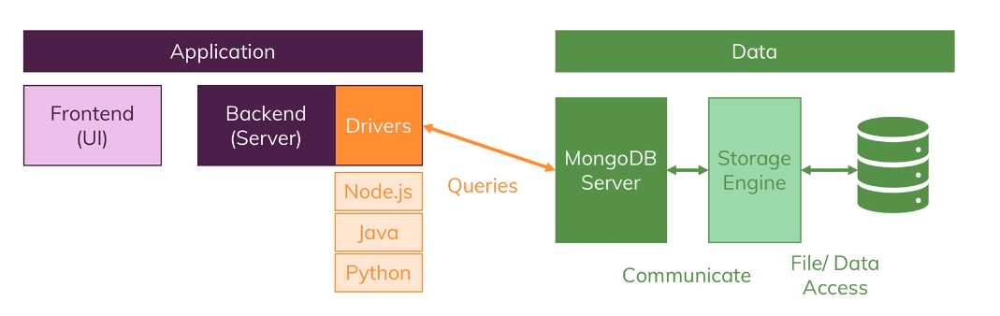
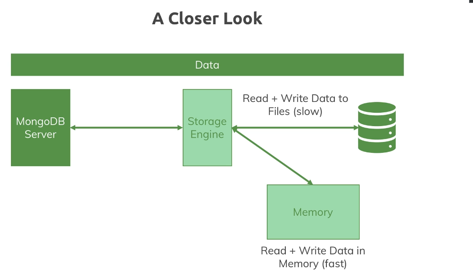
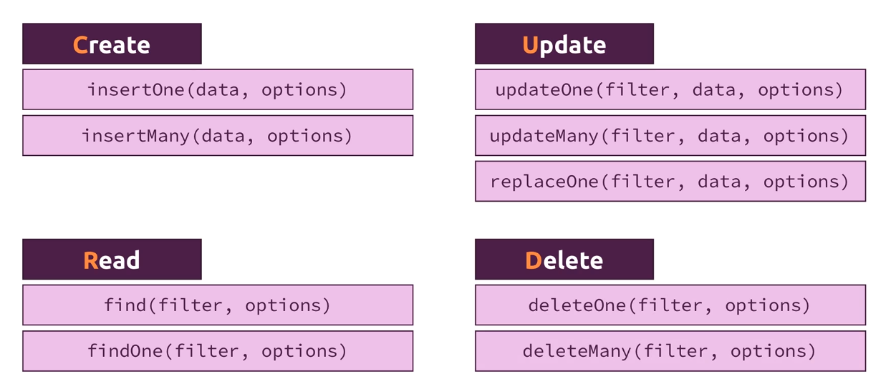

# mongoDB

Hu`mongo`us database

In a db, you have collections, which store schemaless (some data might be incomplete, documents can have different structure) documents in BSON format

You are responsible for the schemaless mess

It's very efficient for apps that have a huge IO workload

Highly efficient, because you can store multiple data in a logical way, not needing to join them like in a SQL db

## Installation

[Check docs](https://www.mongodb.com/docs/manual/installation/)

`Important`

```javascript
The mongodb package provided by Debian is not maintained by MongoDB Inc. and conflicts with the official mongodb-org package. If you have already installed the mongodb package on your Debian system, you must first uninstall the mongodb package before proceeding with these instructions
```

The data directory `/var/lib/mongodb` and the log directory `/var/log/mongodb` are created during the installation

Reset it by starting db with:

```bash
mongod --dbpath <path> --logpath <path>/file-name.log
```

### ulimit considerations

Most Unix-like operating systems limit the system resources that a process may use

These limits may negatively impact MongoDB operation, and should be adjusted

[See UNIX ulimit Settings for Self-Managed Deployments for the recommended settings for your platform](https://www.mongodb.com/docs/manual/reference/ulimit/)

#### Recommended settings

```bash
isaac soft fsize unlimited
isaac hard fsize unlimited

isaac soft cpu unlimited
isaac hard cpu unlimited

isaac soft as unlimited
isaac hard as unlimited

isaac soft memlock unlimited
isaac hard memlock unlimited

isaac soft nofile 64000
isaac hard nofile 64000

isaac soft rss unlimited
isaac hard rss unlimited

isaac soft nproc 64000
isaac hard nproc 64000
```

## Starting mongodb server

`mongod` daemon; the server

`mongosh` mongo shell

## Working with mongoDB

A database can have many collections

Each collection can have many documents

A document is the peace of data stored

Structure



A closer look



## JSON vs BSON

You write JSON, but the driver converts and store it in BSON

It has a binary data

It extends JSON types, example more detailed number types

It has an efficient storage

## Crud operations



Don't use `.update`, use `updateOne` instead

`.update` replaces the data if you don't use the update keywords

`.find()` returns a `Cursor` object containing the data

When querying an array, you can pass just the value you want, for example:

```bash
db.passengers.find()
{
    name: "John",
    hobbies: ["cooking", "cleaning"]
}
...
db.passenger.find({hobbies: "cleaning"})
```

If the array elements are objects, you have to specify all the object or use `$elemMatch` to specify one field of the object

## Projection

> By default, queries in MongoDB return all fields in matching documents
> To limit the amount of data that MongoDB sends to applications, you can include a `projection` document to specify or restrict fields to return

It filters the query in the db itself, so that less data is sent over the wire

The field `_id` is included in all queries. To exclude it, you have to explicit remove with the help from the projection

## Data types

- Text
  - Max size is 16 mB
- Boolean
- Number
  - int32 (+-2,147,483,647) [NumberInt(number)]
  - int64 (+-9,223,372,036,854,775,807) [NumberLong(number)]
  - NumberDecimal
- ObjectId
- ISODate
- Timestamp
- Array
- Embedded document

## Types of relation

### One to one

Prefer embedded documents

### One to many

Two possibilities

- Embedded documents
- Different collection with references

### Many to many

- Embedded documents if duplication is fine
- Different collection with references

## Data modelling and structuring

- In which format will you fetch your Data?
- How often will you fetch and change your Data?
- How much data will you save?
- How is your Data related?
- Will duplicates hurt you?
- Will you hit storage limits? (16 mB / 100 levels)

## Schema validation

- validationLevel
  - It defines what is validated
  - strict or moderate
- validationAction
  - It defines what happens when something (insertion, update) fails
  - log a warn or throws an error

```javascript
db.createCollection('shipping', {
	validator: {
		$jsonSchema: {
			bsonType: 'object',
			title: 'Shipping Country Validation',
			required: ['storeLocation', 'comments'],
			properties: {
				country: {
					enum: ['France', 'United Kingdom', 'United States'],
					description:
						'Must be either France, United Kingdom, or United States',
				},
				storeLocation: {
					bsonType: 'string',
					description: 'Must be a string',
				},
				comments: {
					bsonType: 'array',
					description: 'must be an array',
					items: {
						bsonType: 'object',
						required: ['text', 'author'],
						properties: {
							text: {
								bsonType: 'string',
								description: 'Must be a string',
							},
							author: {
								bsonType: 'objectId',
								description: 'must be an objectId',
							},
						},
					},
				},
			},
		},
	},
});
```

### Change existing validation

```javascript
db.runCommand({
	collMod: 'posts',
	validator: {
		$jsonSchema: {
			bsonType: 'object',
			title: 'Shipping Country Validation',
			required: ['comments'],
			properties: {
				country: {
					enum: [
						'France',
						'United Kingdom',
						'United States',
						'Brazil',
						'Venezuela',
						'Ecuador',
					],
					description:
						'Must be either France, United Kingdom, or United States',
				},
				comments: {
					bsonType: 'array',
					description: 'must be an array',
					items: {
						bsonType: 'object',
						required: ['text', 'author'],
						properties: {
							text: {
								bsonType: 'string',
								description: 'Must be a string',
							},
							author: {
								bsonType: 'objectId',
								description: 'must be an objectId',
							},
						},
					},
				},
			},
		},
	},
	validationLevel: 'warn',
});
```

- Remember to set `validationLevel` either to `warn` or `error`

## Create operation

### `ordered: false`

For `insertMany([], options)`, if there is an error, all the inserted documents remain inserted (no rollback), then the next ones are aborted

You can change this behavior by using `ordered: false` in the options

If there is an error, the errored document is aborted, then the insertion continues with the other documents

### `writeConcern: {w: value, j: boolean, wtimeout: number}`

Write concern describes the level of acknowledgment requested from MongoDB for write operations to a standalone mongod, replica sets, or sharded clusters.

- the w option to request acknowledgment that the write operation has propagated to a specified number of mongod instances or to mongod instances with specified tags.

- the j option to request acknowledgment that the write operation has been written to the on-disk journal, and

- the wtimeout option to specify a time limit to prevent write operations from blocking indefinitely

## Atomicity

MongoDB CRUD operations are atomic on the document level (including embedded documents), meaning that all the properties from a document are inserted, or the document insertion fails

For many documents, for example `insertMany()`, the atomicity is guaranteed per document

## `mongoimport`

[Check docs for more info](https://www.mongodb.com/docs/database-tools/mongoimport/)

```bash
mongoimport tv-shows.json -d movieData -c movies --jsonArray --drop
```
