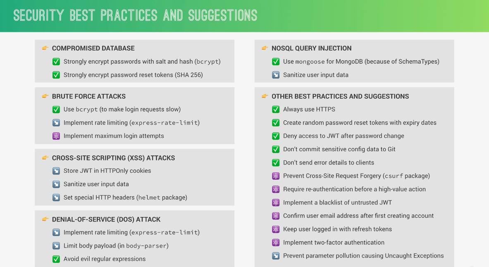

# Node notes

NodeJS is a JavaScript runtime built on google's V8 JavaScript Engine

It's not suited to heavy server-side processing (CPU-intensive), like image manipulation, video conversion, file compression, etc.

## npm versioning

```bash
1.18.11
| | |
| | -> patches (for bug fix only)
| -> minor version (adds new features, no breaking changes)
-> major version (add braking-change features)
```

~ -> updates patches

^ -> updates minor versions

'\*' -> update all

## how web works

1. DNS look-up
2. TCP/IP socket connection
   1. TCP -> break data into small chunks (packages)
   2. IP -> route packages to reach receiver
3. Request
4. Response
5. Response processing (reads files, js, css, assets, .etc)

## node architecture

- V8 engine (C++ and Js): converts js code into machine code that a computer can understand
- libuv: open-source C++ lib for async I/O, gives access to fle system, networking, .etc
  - it implements the event loop and the thread pool

### node process and threads

- it's a program in execution
- node runs in one thread, the main thread
- from the main thread, the event loop off-loads heavy tasks to the thread pool
  - heavy tasks example:file systems apis, compression, DNS lookup, cryptography (hashing passwords for example)
- the thread pool has 4 additional threads (can be configured to use more threads, max 128 threads)

### node event loop

- all code inside callbacks (code that is not top-level) id executed in the event loop
- event-driven architecture
  - events are emitted
  - event loop picks them up
  - callbacks are called
  - event loop does the orchestration

### event loop cycle

- when the app starts, the event loop starts right away
- first phase: expired timer callbacks, like setTimeOut, setInterval
- second phase: I/O pulling and callbacks, like file reading or networking
- third phase: setImmediate callbacks
- fourth phase: close callbacks, like a disconnecting a connection

`process.nextTick()` queue and `microTask` queues are executed after the end of each phase

if after the fourth phase, if there is any pending timers or I/O tasks, a new cycle starts. Otherwise, the program exits

#### DON'T BLOCK THE EVENT LOOP

- Don't use sync versions of functions in fs, crypto, and zlib modules in your callbacks
- Don't perform complex calculations (eg: nested loops)
- Be careful with JSON in large objects
- Don't use too complex regular expressions (eg: nested quantifiers)

These type of actions take time and block the whole application

## the event-driven architecture (observer pattern)

1. event emitter emits an event
2. an event listener is called
3. the callback associated with this listener is called

`create an event emitter by using EventEmitter constructor`

## Streams

Streams extend the EventEmitter class

Process (read and write) data piece by piece (chunks), without completing the operation and without keeping the whole data in memory

- Perfect for processing large volume of data
- More efficient data processing in terms of memory and time

### Readable streams

- Read data
- Important events:
  - data
  - end
- Important functions
  - pipe()
  - read()

### Writable streams

- Write data
- Important events:
  - drain
  - finish
- Important functions
  - write()
  - end()

### Duplex streams

- Both read and write data

### Transform streams

- Duplex streams that transform data as it is processed

### Example

```js
const readable = createReadStream('./data/test-file.txt');

readable.on('data', chunk => {
	res.write(chunk);
});

readable.on('end', () => {
	res.end();
});

readable.on('error', e => {
	console.error(e.message);
	console.error(e.stack);
	res.statusCode = 500;
	res.end(e.message);
});

// const readable = createReadStream('./data/test-file.tx');

// readable.pipe(res);

// another way of writing the stream processing. error handling is missing

server.listen(8000);
```

## Rest api architecture (representational estate transfer api)

- separate api into logical resources
- endpoints use noun in plural version and use http methods for actions
- send data as JSON (usually)
- be stateless
  - all state is handled by the client
  - for a request to be processed, all necessary data has to be sent

## Security


